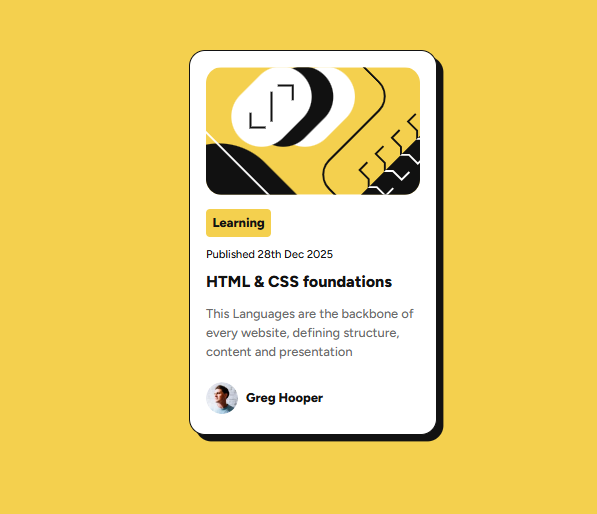
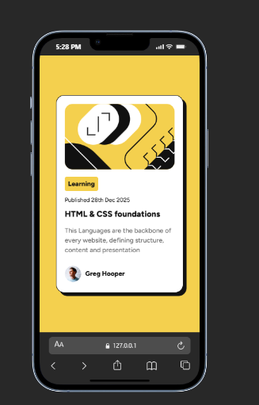

# Frontend Mentor - Blog preview card solution

This is a solution to the [Blog preview card challenge on Frontend Mentor](https://www.frontendmentor.io/challenges/blog-preview-card-ckPaj01IcS). Frontend Mentor challenges help you improve your coding skills by building realistic projects. 

## Table of contents

- [Overview](#overview)
  - [The challenge](#the-challenge)
  - [Screenshot](#screenshot)
  - [Links](#links)
- [My process](#my-process)
  - [Built with](#built-with)
  - [What I learned](#what-i-learned)
  - [Continued development](#continued-development)
  - [Useful resources](#useful-resources)
- [Author](#author)

## Overview

### The challenge

The blog preview card is a responsive, interactive component that displays article information with a clean and modern design. Users can interact with the card and see visual feedback on hover and focus states.

Users should be able to:

- View a blog preview card with article details including an image, category tag, publication date, title, description, and author information
- See hover and focus states for all interactive elements on the page
- Experience a responsive design that adapts to different screen sizes
- Access the article content through a clearly presented preview

### Screenshots

#### Desktop View


#### Mobile View


### Links

- Solution URL: [GitHub Repository](https://github.com/kayode96-max/BlogPost)
- Live Site URL: [https://blogpost-f-e-m-l.vercel.app/](https://blogpost-f-e-m-l.vercel.app/)

## My process

### Development Approach

My development process followed a structured and methodical approach to ensure a high-quality final product:

**1. Planning & Requirements Analysis**
- Analyzed the Frontend Mentor challenge requirements and design specifications
- Identified key interactive elements and responsive breakpoints
- Planned the HTML structure for semantic markup and accessibility

**2. HTML Structure Development**
- Created semantic HTML5 with proper semantic elements (main, img with alt text)
- Built a logical hierarchy with heading levels (h1, h2, p)
- Added descriptive alt text for all images for accessibility
- Structured the author section and article details in logical containers

**3. CSS Styling & Layout**
- Implemented CSS custom properties for color management and maintainability
- Used Flexbox for the author details section alignment
- Applied CSS Grid concepts for overall card structure organization
- Created responsive padding and sizing relative to viewport
- Developed the distinctive 8px box-shadow for visual depth and elevation
- Applied consistent border-radius for modern, polished appearance

**4. Typography Implementation**
- Integrated custom Figtree variable fonts via @font-face
- Set proper font weights for visual hierarchy (800 for headings, regular for body)
- Configured font-display: swap for optimal performance and user experience
- Ensured readable font sizing across different content types

**5. Color & Visual Hierarchy**
- Used HSL color space for precise color control
- Applied strategic color contrasts to guide user attention
- Created visual emphasis through font weight and color combinations
- Maintained accessibility with proper contrast ratios

**6. Testing & Refinement**
- Tested the design on multiple screen sizes
- Verified hover and focus states for interactive elements
- Validated semantic HTML and accessibility features
- Fine-tuned spacing and proportions for visual balance

**7. Deployment**
- Deployed the final solution to Vercel for live hosting
- Ensured all assets load correctly from the assets directory
- Verified the live site functionality and performance

### Built with

- **Semantic HTML5 markup** - Properly structured HTML with meaningful elements for better accessibility and SEO
- **CSS custom properties (variables)** - Used for consistent color management and easy theme adjustments
- **Flexbox** - For flexible layout of the author section and card alignment
- **CSS Grid** - For organizing the overall card structure and spacing
- **Mobile-first workflow** - Responsive design approach starting from mobile and scaling up
- **Custom Google Fonts (Figtree)** - Professional typography with variable font weights (500-800)
- **CSS Box Shadows** - For the distinctive elevated shadow effect on the card
- **CSS Border Radius** - For smooth, modern rounded corners on images and elements

### What I learned

Through building this blog preview card, I gained valuable experience in several areas:

**1. Custom Font Integration**
- Learned how to implement local @font-face declarations with variable fonts
- Understood font weight variations and how to use them effectively across the design
- Implemented font-display: swap for better performance and user experience

```css
@font-face {
    font-family: 'Figtree';
    src: url('./assets/fonts/Figtree-VariableFont_wght.ttf') format('truetype');
    font-weight: 500 800;
    font-display: swap;
}
```

**2. Responsive Card Design**
- Created a fixed-width card that centers on the viewport with proper padding
- Used flexbox to align the author details in a horizontal layout
- Implemented proper spacing and proportions for visual hierarchy

**3. Visual Effects**
- Mastered CSS box-shadow for creating the distinctive 8px offset shadow effect
- Applied border-radius consistently across different elements for design cohesion
- Used color variables (hsl) for precise color management and consistency

```css
.container {
    border-radius: 20px;
    border: 1px solid hsl(0, 0%, 7%);
    box-shadow: 8px 8px 0 0 hsl(0, 0%, 7%);
}
```

**4. Semantic HTML Best Practices**
- Used appropriate semantic elements (main, img with alt text, heading hierarchy)
- Implemented accessible image descriptions for better screen reader support
- Structured content logically for both human and machine readability

**5. Color Management**
- Used HSL color space for intuitive color adjustments (hue, saturation, lightness)
- Created visual hierarchy through color contrast and weight variations
- Understood how color relates to UI emphasis and user interaction

### Continued development

In future projects, I plan to focus on:

- **Interactive Enhancements**: Adding hover and active states with smooth transitions and transforms
- **Advanced Responsiveness**: Implementing breakpoints for tablets and larger screens with CSS media queries
- **Animation Effects**: Creating subtle animations for card entrance and interactive elements using CSS animations and transitions
- **Accessibility Improvements**: Adding focus states, ARIA labels, and keyboard navigation support
- **State Management**: Implementing JavaScript for dynamic content loading and interactive features
- **Performance Optimization**: Optimizing image sizes, implementing lazy loading, and minimizing CSS
- **Dark Mode Support**: Adding CSS custom properties for theme switching capability

### Useful resources

- [CSS Tricks - A Complete Guide to Flexbox](https://css-tricks.com/snippets/css/a-guide-to-flexbox/) - Excellent reference for flexbox properties and alignment
- [MDN - CSS Custom Properties (Variables)](https://developer.mozilla.org/en-US/docs/Web/CSS/--*) - Deep dive into CSS variables and their usage
- [Google Fonts Variable Fonts](https://fonts.google.com/?vfonly=true) - Understanding variable fonts and their implementation
- [Color Hunt](https://colorhunt.co/) - Inspiration for color palettes and combinations
- [Responsive Design Patterns](https://www.patterns.dev/) - Learning modern responsive design approaches
- [The Markdown Guide](https://www.markdownguide.org/) - Reference for markdown syntax and best practices

## Author


- **LinkedIn** - [Your LinkedIn Profile](https://linkedin.com/in/kayode96max)
- **GitHub** - [Your GitHub Profile](https://github.com/kayode96-max)
- **Portfolio Website** - [Your Portfolio](https://www.abdullahiusman.tech)

Feel free to reach out if you have any feedback or want to collaborate on projects!

- Twitter - [@yourusername](https://www.twitter.com/kayode96max)

